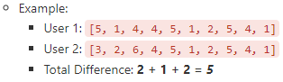
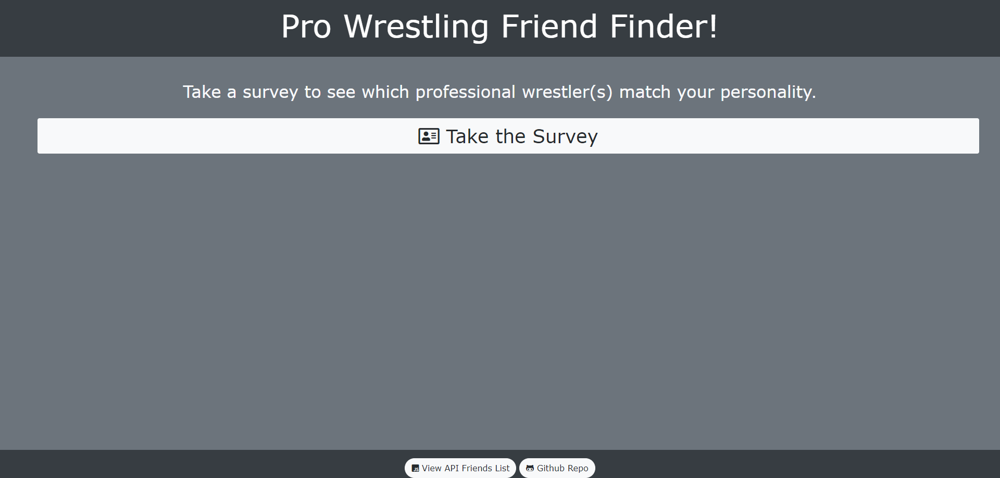
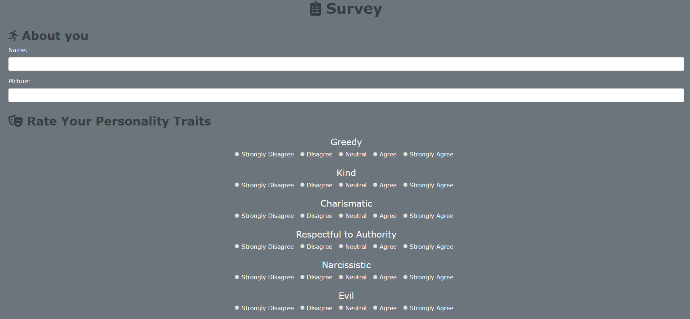

# FriendFinder

## Description

"Friend Finder" is essentially a dating app, with a twist. I changed the "matches" to "pro wrestling friends"! Upon completing the survey, the user will see which pro wrestler matches the user's personality. This app features a Node server, routing, a home HTML page, a survey HTML page, Bootstrap, Font Awesome, and validation.

## Methodology

Pro wrestler friends are found by comparing a given pro wrestler's personality traits with the user's personality traits.

## Website Sections

### Home Page

#### API Friends List

Displays the API's JSON file.

#### Github Repo

Links back to this page.

### Survey

Enter your name and a valid photo URL to be added to the pro wrestling friends API JSON file. If you'd prefer not to be added, enter gibberish in the URL field.

### Modal Pop-up

After completing the survey, a pop-up with your friend or friends will be displayed.

